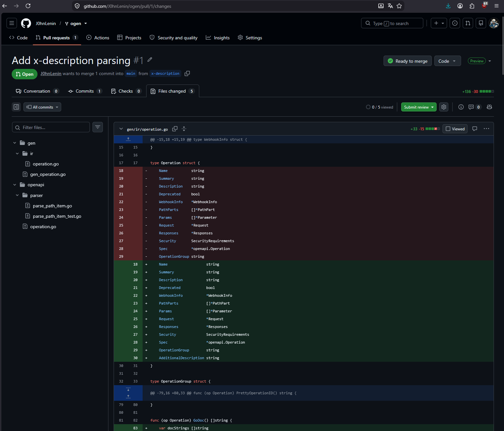

# ogen-example

Репозиторий содержит пример построения полноценного сервиса на Go с использованием генерации кода по OpenAPI-спецификации через **ogen**. В проекте демонстрируется:

- Генерация **серверной** и **клиентской** частей из единой спецификации.
- Реализация бизнес-логики с соблюдением принципов чистой архитектуры.
- Использование **кастомного форка ogen** с дополнительными возможностями.
- Контейнеризация через Docker Compose, включая Swagger UI для интерактивной документации.

---

## Запуск

Склонируйте репозиторий и поднимите все сервисы:

```bash
git clone https://github.com/J0hnLenin/ogen-example
cd ./ogen-example
docker compose up --build
```

После запуска будут доступны:

- **Сервер API** – `http://localhost:8000/api/v1`
- **Swagger UI** – `http://localhost:8080`
- **Клиент-генератор**

---

## Описание API

Спецификация OpenAPI описывает CRUD-операции над сущностью **Игрок**.

### Структура Player
```json
{
  "id": 1,
  "name": "Alice",
  "score": 95.5
}
```

### Доступные эндпоинты

| Метод | Путь                 | Описание                           |
|-------|----------------------|------------------------------------|
| GET   | `/players`           | Получить список всех игроков       |
| GET   | `/players/{id}`      | Получить игрока по ID              |
| POST  | `/players`           | Создать нового игрока              |
| PUT   | `/players/{id}`      | Полностью обновить игрока          |
| PATCH | `/players/{id}`      | Частично обновить игрока           |
| DELETE| `/players/{id}`      | Удалить игрока                     |

Все эндпоинты обслуживаются с префиксом `/api/v1`.

---

## Использование ogen

### Внесённые изменения в ogen

В проекте используется **собственный форк** ogen, в который были добавлены улучшения, необходимые для данного примера.  
Основные изменения описаны в [pull request](https://github.com/J0hnLenin/ogen/pull/1/changes).



## Внесённые изменения в ogen

В рамках проекта в [кастомный форк ogen](https://github.com/J0hnLenin/ogen) были добавлены расширения, позволяющие гибко управлять генерируемой документацией и группировкой операций.

### Основные доработки

1. **Поддержка расширения `x-description`**  
   Добавлено новое поле `additionalDescription` для операций (`Operation`), которое парсится из расширения `x-description` в OpenAPI-спецификации. Это позволяет добавить дополнительный поясняющий текст к операции, который будет включён в сгенерированную документацию (GoDoc) наряду со стандартными `summary` и `description`.

   **Использование в спецификации:**
   ```yaml
   /players:
     get:
       summary: Получить всех игроков
       description: Возвращает массив объектов Player
       x-description: "Порядок может быть любым"
   ```

   В сгенерированном коде метод `Handler.GetPlayers` получит полный комментарий, включая основное описание и дополнительный текст.

2. **Адаптация генератора GoDoc**  
   Метод `Operation.GoDoc()` модифицирован так, что если заполнено поле `AdditionalDescription`, оно добавляется после основного описания с пустой строкой для разделения.

### Структура изменений

| Файл                        | Изменения |
|-----------------------------|-----------|
| `gen/ir/operation.go`       | Добавлено поле `AdditionalDescription`, обновлён метод `GoDoc`. |
| `gen/gen_operation.go`      | Чтение поля `XAdditionalDescription` из `openapi.Operation`. |
| `openapi/parser/parse_path_item.go` | Добавлена функция `parseAdditionalDescription` и константа `xAdditionalDescription`. |
| `openapi/operation.go`      | Добавлено поле `XAdditionalDescription` в структуру `Operation`. |
| `openapi/parser/parse_path_item_test.go` | Добавлены unit-тесты для нового расширения. |

### Тестирование

Новые возможности покрыты тестами, проверяющими как наличие, так и отсутствие расширения `x-description` в спецификации.

> **Примечание:** Все изменения совместимы с предыдущими версиями спецификаций – поле является опциональным.

---

Подробный diff доступен в [pull request](https://github.com/J0hnLenin/ogen/pull/1/changes)


### Генерация файлов сервера

```bash
ogen --target=./server/internal/api/playersapi \
     --package=playersapi \
     --config ./api/players_api/server.ogen.yml \
     ./api/players_api/openapi.yml
```

### Генерация файлов клиента

```bash
ogen --target=./client/internal/api/playersapi \
     --package=playersapi \
     --config ./api/players_api/client.ogen.yml \
     ./api/players_api/openapi.yml
```

Сгенерированные пакеты содержат:
- Интерфейс `Handler` (для сервера) и `Client` (для клиента).
- Все DTO-структуры (запросы/ответы).
- HTTP‑маршрутизацию и сериализацию.

---

## Описание сервисов

### Сервер

Сервер реализует бизнес-логику и обрабатывает входящие HTTP-запросы.

#### Структура пакетов

```
server/
├── cmd/app/                 # точка входа
├── internal/
│   ├── api/
│   │   └── playersapi/      # сгенерированный ogen-код
│   │   └── playersapiseive/ # обёртка над api
│   ├── config/              # загрузка конфига
│   ├── bootstrap/           # запуск c слоёв сервера
│   ├── models/              # доменные модели
│   ├── services/            # бизнес-логика (PlayerService)
│   └── storage/             # реализация хранилища (in-memory)
```

#### Ответственность пакетов

- **`playersapi`** – полностью сгенерированный транспортный слой.
- **`playersserviceapi`** – адаптер, реализующий интерфейс `Handler` и делегирующий вызовы в `PlayerService`.
- **`services/playerservice`** – бизнес-логика, независимая от HTTP.
- **`storage/memstorage`** – in-memory хранилище для игроков.
- **`bootstrap`** – собирает все зависимости и запускает HTTP-сервер с CORS и graceful shutdown.

#### Логи работы сервера (пример)

```
server  | 2026/07/24 11:14:13 Server listen: 0.0.0.0:8000
server  | [cors] 2026/07/24 11:14:16 Handler: Actual request
server  | [cors] 2026/07/24 11:14:16   Actual request no headers added: missing origin
server  | [cors] 2026/07/24 11:14:52 Handler: Actual request
server  | [cors] 2026/07/24 11:14:52   Actual response added headers: map[Access-Control-Allow-Credentials:[true] Access-Control-Allow-Origin:[http://localhost:8080] Vary:[Origin]]
...
```

---

### Клиент

Клиент периодически генерирует случайные данные и отправляет запросы на сервер, демонстрируя работу сгенерированного клиента.

#### Структура пакетов

```
client/
├── cmd/app/               # точка входа
├── internal/
│   ├── api/
│   │   ├── playersapi/    # сгенерированный ogen-клиент 
│   │   └── clientservice/ # обёртка над клиентом с логированием
│   ├── config/            # загрузка конфига
│   ├── bootstrap/         # инициализация и запуск цикла генерации
│   └── gen/               # генератор случайных данных (имена, очки)
```

#### Ответственность пакетов

- **`playersapi`** – сгенерированный клиент (структура `Client`, методы для каждого эндпоинта).
- **`clientservice`** – обёртка, вызывающая методы клиента и логирующая результаты.
- **`gen`** – генерация случайных `PlayerInput` и `PlayerPartial`.
- **`bootstrap`** – создание клиента, запуск бесконечного цикла с таймером, выполнение случайных операций.
- **`config`** – загрузка параметров (URL сервера, интервал, batch size).

#### Логи работы клиента (пример)

```
client  | 2026/07/24 11:01:42 Client started. Server: http://server:8000/api/v1, interval: 5s
client  | 2026/07/24 11:02:18 [GET] Found 1 players
client  | 2026/07/24 11:02:18   - ID=1, Name=Player-2, Score=53.78
client  | 2026/07/24 11:02:19 [CREATE] ID=2, Name=Player-1, Score=18.56
client  | 2026/07/24 11:02:20 [PATCH] ID=2, Name=Player-2, Score=18.56
client  | 2026/07/24 11:02:22 [CREATE] ID=3, Name=Player-9, Score=13.67
client  | 2026/07/24 11:02:23 [GET] Found 3 players
client  | 2026/07/24 11:02:23   - ID=2, Name=Player-2, Score=18.56
client  | 2026/07/24 11:02:23   - ID=3, Name=Player-9, Score=13.67
client  | 2026/07/24 11:02:23   - ID=1, Name=Player-2, Score=53.78
client  | 2026/07/24 11:02:24 [GET] Found 3 players
client  | 2026/07/24 11:02:24   - ID=1, Name=Player-2, Score=53.78
client  | 2026/07/24 11:02:24   - ID=2, Name=Player-2, Score=18.56
client  | 2026/07/24 11:02:24   - ID=3, Name=Player-9, Score=13.67
client  | 2026/07/24 11:02:25 [PATCH] ID=2, Name=Player-2, Score=99.26
client  | 2026/07/24 11:02:26 [CREATE] ID=4, Name=Player-6, Score=25.86
client  | 2026/07/24 11:02:27 [GET] Found 4 players
client  | 2026/07/24 11:02:27   - ID=2, Name=Player-2, Score=99.26
client  | 2026/07/24 11:02:27   - ID=3, Name=Player-9, Score=13.67
client  | 2026/07/24 11:02:27   - ID=4, Name=Player-6, Score=25.86
client  | 2026/07/24 11:02:27   - ID=1, Name=Player-2, Score=53.78
```

---

## 📦 Конфигурация

Конфигурационные файлы монтируются в контейнеры, поэтому изменения не требуют пересборки – достаточно перезапустить контейнер.

- `server/config.yml` – настройки сервера (хост, порт, префикс).
- `client/config.yml` – настройки клиента (URL сервера, интервал).

---

## 🧩 Дополнительно

Проект служит демонстрацией возможностей **ogen** и может использоваться как шаблон для быстрого старта.

---
